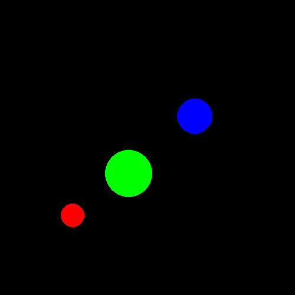

# Ball Collision Simulation

This repository contains a Python script that simulates collisions between balls of different masses and radii using the Pygame library. The main feature of this simulation is the `coll(ball1, ball2)` function, which handles collision events between two `Ball` objects.

## Features

- **Collision Simulation**: Simulates the elastic collision between two balls, taking into account their masses, radii, and velocities.
- **Accurate Collision Handling**: The simulation includes a method to calculate the relative velocity between two balls, then rewinds time to the exact moment of contact to execute the collision accurately.
- **Pygame Visualization**: The simulation is visualized using Pygame, allowing you to see the balls move and collide in real-time.

## Installation

1. Clone the repository:
    ```bash
    git clone https://github.com/gmg00/ball_collision.git
    cd ball_collision
    ```

2. Install the required dependencies:
    ```bash
    pip install pygame
    ```

3. Run the simulation:
    ```bash
    python balls.py
    ```

## Usage

The main class in the script is `Ball`, which represents a ball in the simulation. Each `Ball` object has properties like position, velocity, mass, and radius. The simulation handles the movement and collision of these balls in a 2D space.

### `coll(ball1, ball2)`

The `coll(ball1, ball2)` function is the core of this simulation. It takes two `Ball` objects as arguments and manages the collision event between them. Here’s how it works:

1. **Relative Velocity Calculation**: The function first calculates the relative velocity between the two balls to determine their approach speed and direction.

2. **Backtracking**: To ensure an accurate collision, the balls are "rewound" to the exact moment of contact before the collision occurs.

3. **Collision Execution**: Using the principles of conservation of momentum and kinetic energy, the function computes the new velocities and directions of the balls after the collision.

This approach ensures that the simulation accurately reflects the physics of real-world collisions between objects of varying masses and sizes.

## Demo



## Contributing

Contributions are welcome! If you have any ideas for improvements or new features, feel free to open an issue or submit a pull request.

## License

This program is free software: you can redistribute it and/or modify it under the terms of the GNU General Public License as published by the Free Software Foundation, either version 3 of the License, or (at your option) any later version.

This program is distributed in the hope that it will be useful, but WITHOUT ANY WARRANTY; without even the implied warranty of MERCHANTABILITY or FITNESS FOR A PARTICULAR PURPOSE. See the GNU General Public License for more details.

You should have received a copy of the GNU General Public License along with this program. If not, see https://www.gnu.org/licenses/.
